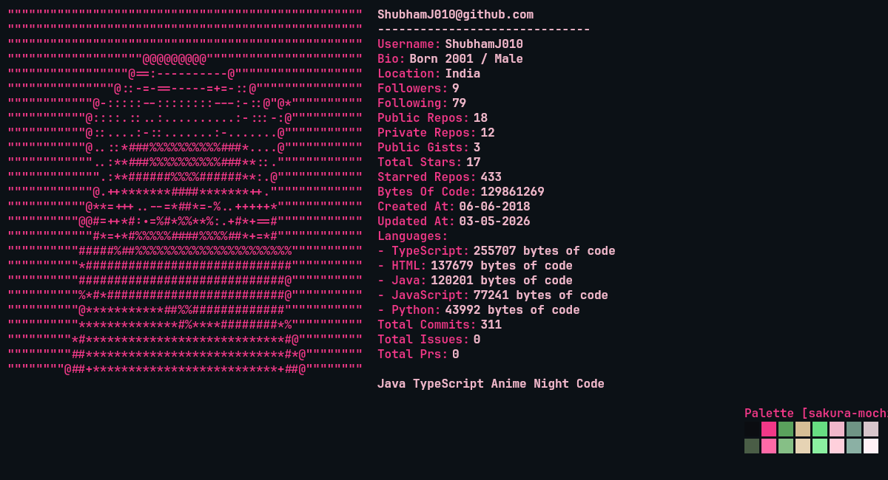

## Hi there <a href="https://github.com/shubhamj010"></a>, I'm Shubham Jha!

<a href="https://flowcv.com/resume/cqqqb67qrh" target="_blank">
  
</a>
<p align="center"><font face="Comic Sans MS">click ascii for resume</font></p>

<table align="center" width="100%">
  <tr>
    <td align="center"></td>
    <td align="center"><a href="https://github.com/sindresorhus/awesome"></a></td>
    <td align="center"><a href="https://in.linkedin.com/in/shubhamj010?trk=profile-badge"></a></td>
  </tr>
</table>


<font face="JetBrains Mono"><b>Java ∘ TypeScript ∘ Bash.</b></font>

<p align="right">
  <a href="https://x.com/shubham_j010"></a>&emsp;
  <a href="https://www.reddit.com/user/Shubham_Jha/"></a>&emsp;
  <a href="https://discordapp.com/users/283568690514100225/"></a>&emsp;
  <a href="https://www.instagram.com/shubham.j010/"></a>
</p>

```java
public final class Shubham implements JavaDeveloper, AnimeEnjoyer, NightCoder {

    Stack stack = Stack.of("Java", "Spring Boot", "Angular", "TypeScript", "Microservices");

    Tooling tools = Tooling.use("GitHub", "Docker", "OpenCode", "Codex", "VS Code", "zsh");

    OS os = OS.run("macOS", "Android");

    @Override
    public void live() {
        code();
        watchAnime();
        ship();
        repeat();
    }
}
```

## Tech_💖

<p style="display: flex; align-items: center; gap: 12px; flex-wrap: wrap;">
  
  
  
  
  
  
  
  
</p>

<p align="right"></p>

## VibingTo

<p align="center">
  <a href="https://www.last.fm/user/Shubham_jha"></a>&emsp;&emsp;<a href="https://anilist.co/user/ShubhamJha/"></a>&emsp;  <a href="https://myanimelist.net/profile/SHUBHAM_jha"></a>&emsp;<a href="https://simkl.com/2218813/stats/"></a>
</p>

<p align="center">
  <a href="https://www.last.fm/user/Shubham_jha">
    
  </a>
</p>

## GithubStats

<!--START_GITHUB_STATS-->

<p align="center">
  
</p>

<!--END_GITHUB_STATS-->


<p align="center"></p>
<p align="center">𐌔💖𐌍</p>
